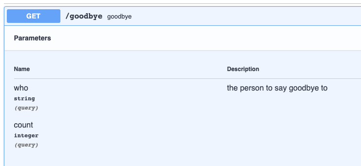
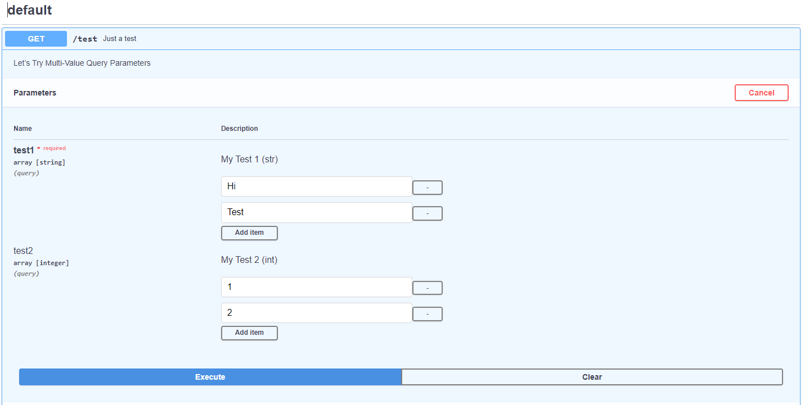

# Serverless Auto Swagger

This plugin allows you to automatically generate a swagger endpoint, describing your application endpoints. This is built from your existing serverless config and typescript definitions, reducing the duplication of work.

## Install

```sh
yarn add --dev serverless-auto-swagger
# or
npm install -D serverless-auto-swagger
```

Add the following plugin to your `serverless.yml` or `serverless.ts`:

```yaml
plugins:
  - serverless-auto-swagger
```

```ts
plugins: ['serverless-auto-swagger']
```

## Usage

This plugin is designed to work with vanilla Serverless Framework. All you need to do is add this plugin to your plugin list and it will generate the swagger file and add the endpoints required. When you deploy your API, your new swagger UI will be available at `https://{your-url-domain}/swagger`.

You can also run `sls generate-swagger` if you want to generate the swagger file without deploying the application.

## Config Options

```yaml
custom:
    autoswagger:
        apiType?: 'http' | 'httpApi'
        generateSwaggerOnDeploy?: true | false
        typefiles?: ['./src/types/typefile1.d.ts', './src/subfolder/helper.d.ts']
        swaggerFiles?: ['./doc/endpointFromPlugin.json', './doc/iCannotPutThisInHttpEvent.json', './doc/aDefinitionWithoutTypescript.json']
        swaggerPath?: 'string'
        apiKeyHeaders?: 'string[]'
        useStage?: true | false
        basePath?: '/string'
        schemes?: ['http', 'https', 'ws', 'wss']
```

`generateSwaggerOnDeploy` is a boolean which decides whether to generate a new swagger file on deployment. Default is `true`.

`typefiles` is an array of strings which defines where to find the typescript types to use for the request and response bodies. Default is `./src/types/api-types.d.ts`.

`swaggerFiles` is an array of string which will merge custom json OpenApi 2.0 files to the generated swagger

`swaggerPath` is a string for customize swagger path. Default is `swagger`. Your new swagger UI will be available at `https://{your-url-domain}/{swaggerPath}`

`apiType` is the optional API type for which your Swagger UI and Swagger JSON lambdas should be deployed. Options are `http` and `httpApi`. Defaults to `httpApi` if not specified.

`apiKeyHeaders` is an array of strings used to define API keys used in auth headers. For example, if you want to send the `Authorization` and `x-api-key`, then you would set:
```yml
apiKeyHeaders: ['Authorization', 'x-api-key']
```

`useStage` is a bool to either use current stage in beginning of path or not. The Default is `false`. For example, if you use it enabled (`true`) and your stage is `dev` the swagger will be in `dev/swagger`

`basePath` is an optional string that can be prepended to every request (i.e. `http://localhost/basePath/my-endpoint`). Should include leading `/`.

`schemes` is an optional array (containing one of `http`, `https`, `ws`, or `wss`) for specifying schemes. If not provided, uses the scheme used to serve the API specification (reflecting Swagger's behavior)

## Adding more details

The default swagger file from vanilla Serverless framework will have the correct paths and methods but no details about the requests or responses.

### API Summary and Details

The optional attributes `summary` and `description` can be used to describe each HTTP request in Swagger.

`swaggerTags` is an optional array that can be used to group HTTP requests with a collapsible name
(i.e. grouping two endpoints `GET /dogs` and `POST /dogs` together).
If not specified, all HTTP requests will be grouped under `default`.

```js
http: {
    summary: 'This is a cool API',
    description: 'Cool API description is here',
    swaggerTags: ['Dogs']
}
```

### Adding Data Types

This plugin uses typescript types to generate the data types for the endpoints. By default, it pulls the types from `src/types/api-types.d.ts`.

You can then assign these typescript definitions to requests as `bodyType` on the http or https config, or to the response as seen just below.

### Responses

You can also add expected responses to each of the http endpoint events. This is an object that contains the response code with some example details:

```js
responseData: {
    // response with description and response body
    200: {
        description: 'this went well',
        bodyType: 'helloPostResponse',
    },

    // response with just a description
    400: {
        description: 'failed Post',
    },
    // shorthand for just a description
    502: 'server error',
}
```

### Post request expected body

When you create a `POST` or `PUT` endpoint, you expect to receive a specific structure of data as the body of the request.

You can do that by adding a `bodyType` to the http event:

```js
http: {
    path: 'hello',
    method: 'post',
    cors: true,
    bodyType: 'helloPostBody',
}
```

### Query String Parameters

If you want to specify the query string parameters on an endpoint you can do this by adding an object of `queryStringParameters` to the event (original I know). This has two required properties of `required` and `type` as well as an optional `description`.

```js
http: {
    path: 'goodbye',
    method: 'get',
    queryStringParameters: {
        bob: {
            required: true,
            type: 'string',
            description: 'bob',
        },
        count: {
            required: false,
            type: 'integer',
        },
    },
},
```



### Multi-Valued Query String Parameters

If you use multi-value query string parameters (array), then you must specify that your `type` is `array` and specify your data type (string or integer) in `arrayItemsType`

```js
http: {
    path: 'goodbye',
    method: 'get',
    queryStringParameters: {
        bob: {
            required: true,
            type: 'array',
            arrayItemsType : 'string',
            description: 'bob',
        },
        count: {
            required: false,
            type: 'array',
            arrayItemsType : 'integer',
        },
    },
},
```



### Header Params

Works the same way as `queryStringParameters`, but for headers.

To use it, just define it under `headerParameters`:

```js
http: {
    path: 'goodbye',
    method: 'get',
    headerParameters: {
        bob: {
            required: true,
            type: 'string',
            description: 'bob',
        },
        count: {
            required: false,
            type: 'integer',
        },
    },
},
```

### Exclude an endpoint

You can exclude some endpoints from the swagger generation by adding `exclude` to the http event:

```js
http: {
    path: 'hello',
    method: 'post',
    exclude: true,
}
```

## with Serverless Offline

In the plugin list, you must list serverless-auto-swagger before the serverless-offline plugin. If you don't you won't get the required endpoints added to your local endpoints.
